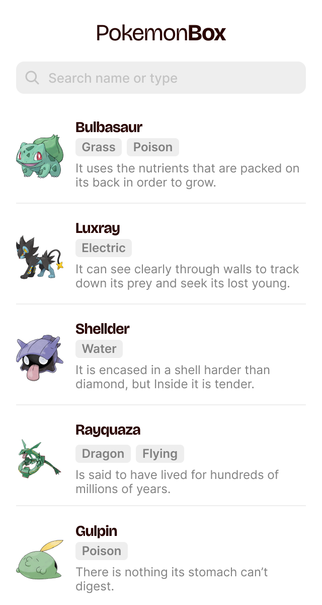

# PokemonBox

PokemonBox is a Kotlin Android application providing access to a database of pokemon (provided by https://pokeapi.co) and allows the user to browse it as a list and to search pokemon by name (ex: "Bulbasaur").
 
 

## Open-source libraries
- [Kotlin](https://kotlinlang.org/) based, [Coroutines](https://github.com/Kotlin/kotlinx.coroutines) + [Flow](https://kotlin.github.io/kotlinx.coroutines/kotlinx-coroutines-core/kotlinx.coroutines.flow/) for asynchronous.
- [Kotlin Serialization](https://github.com/Kotlin/kotlinx.serialization): Kotlin multiplatform / multi-format serialization.
- [Ktor](https://github.com/ktorio/ktor): for making network requests.
- [Koin](https://github.com/InsertKoinIO/koin): as dependency injection framework.
- [Material 3](https://m3.material.io/components): Material 3 components.

## Authors

- [@khalidb91](https://www.github.com/khalidb91)

## 🔗 Social Links
  
[Follow me](https://github.com/khalidb91) on GitHub